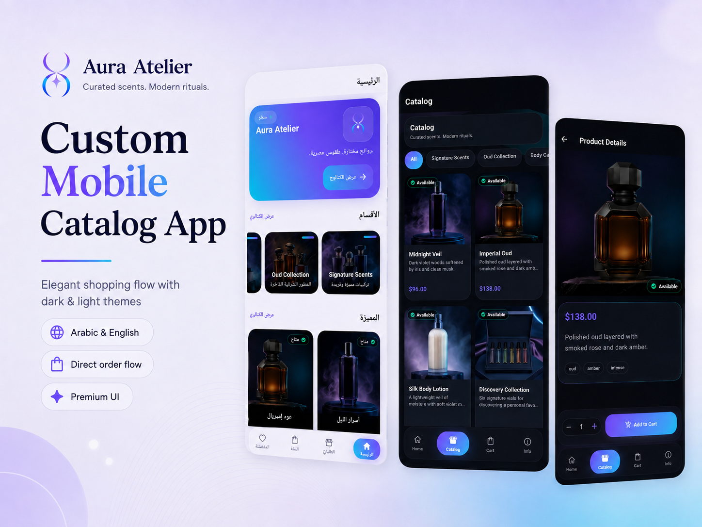
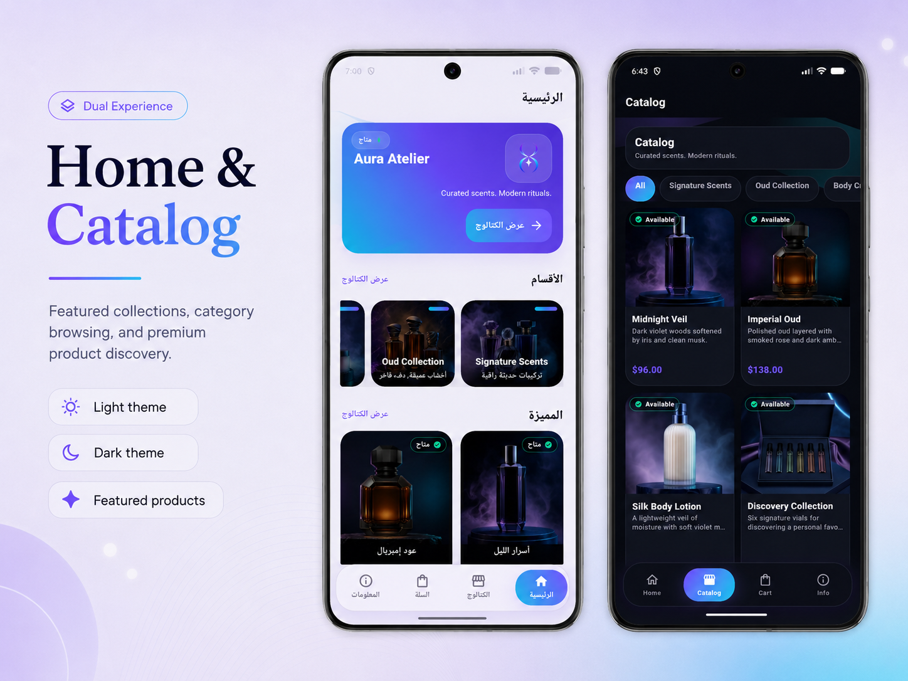
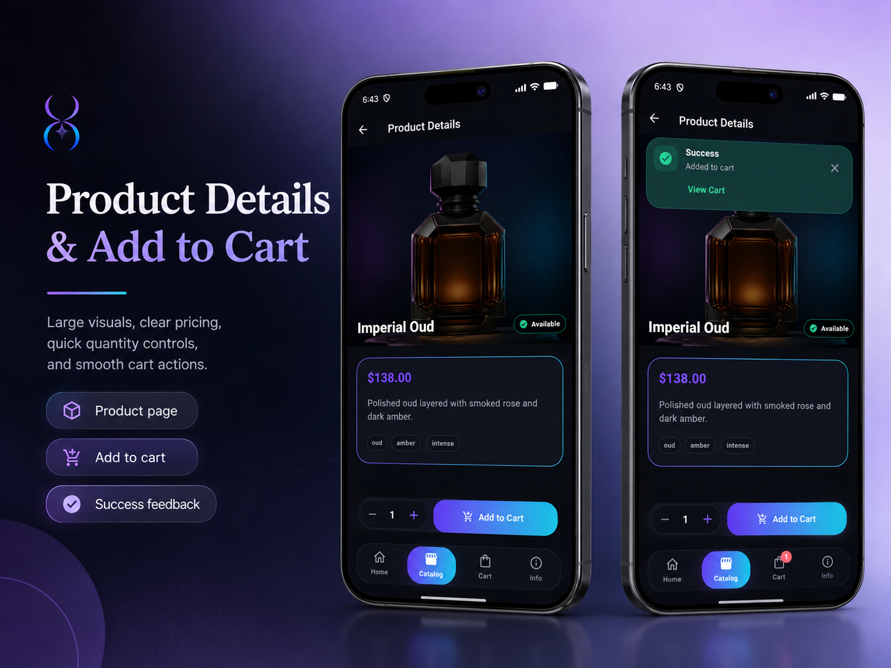
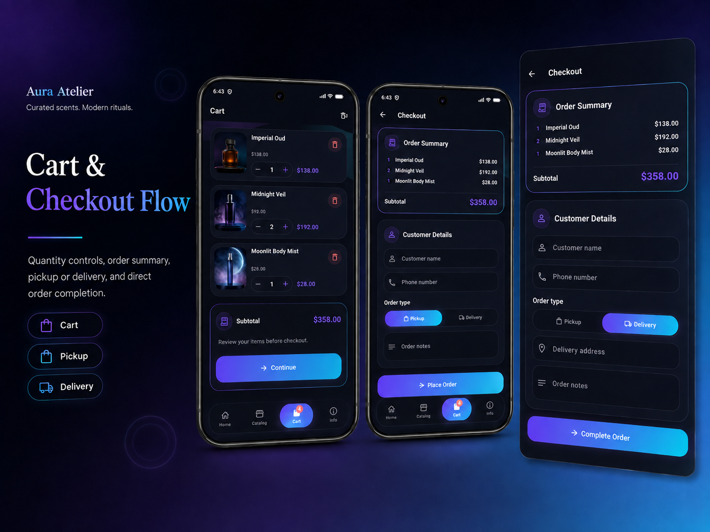
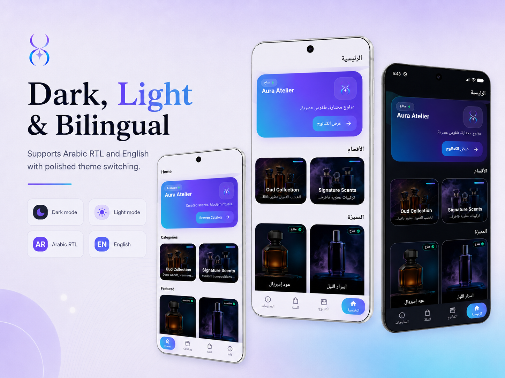
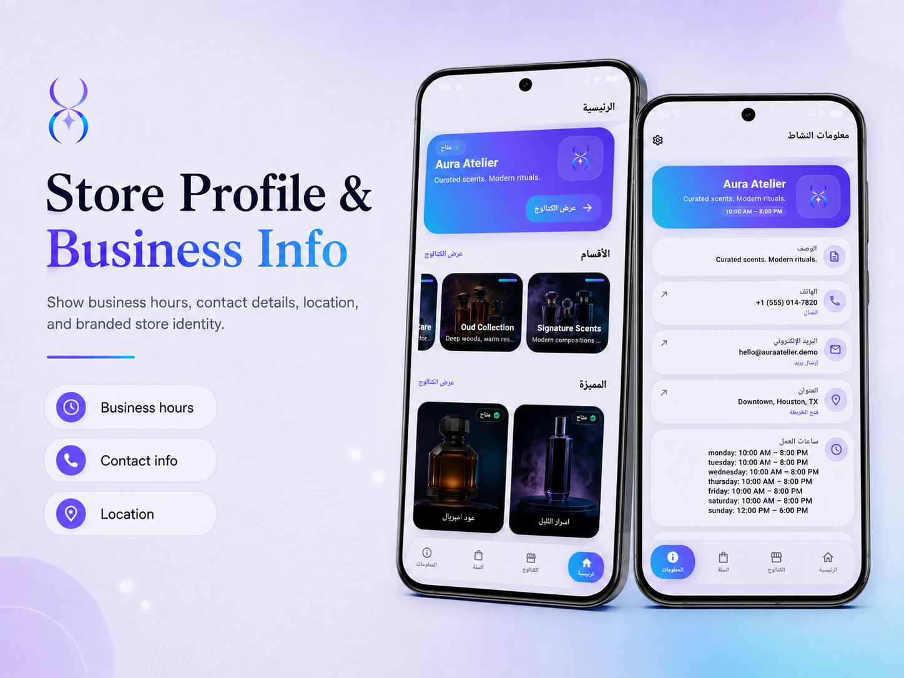

# Business Catalog

A reusable, production-oriented Flutter business catalog template for small businesses that need a mobile product or service catalog without requiring a backend.

The app provides a configurable catalog, in-memory cart, checkout flow, and WhatsApp order handoff. It is designed to be adapted for businesses such as restaurants, bakeries, perfume stores, salons, boutiques, and service providers.

## Highlights

- Cross-platform Flutter application for Android and iOS.
- Configurable business, category, and product data through local JSON.
- Shopping cart and checkout validation.
- WhatsApp order generation and handoff.
- English and Arabic localization with full RTL/LTR support.
- Responsive Material 3 interface.
- Persistent theme and language preferences.
- Defensive catalog validation and missing-image fallbacks.
- Feature-first project architecture.
- No backend, Firebase, authentication, or payment provider required.

## Tech Stack

- **Framework:** Flutter
- **Language:** Dart
- **State Management:** Riverpod
- **Navigation:** GoRouter
- **Models:** Freezed, json_serializable
- **Localization:** Flutter gen_l10n, ARB, intl
- **Local Storage:** shared_preferences
- **External Links:** url_launcher
- **UI:** Material 3

## Screenshots

### App Overview

<p align="center">
  
</p>

### Home & Catalog

<p align="center">
  
</p>

### Product Details & Cart

<p align="center">
  
</p>

### Cart & Checkout

<p align="center">
  
</p>

### Dark, Light & Bilingual Support

<p align="center">
  
</p>

### Business Information

<p align="center">
  
</p>

## Features

- Android and iOS Flutter mobile app.
- Material 3 visual system with business-configurable colors.
- Feature-first folder structure.
- Riverpod state management.
- GoRouter navigation with a persistent bottom app shell.
- Local JSON catalog loaded from assets.
- Freezed and `json_serializable` data models.
- Local in-memory cart.
- Checkout form with pickup and delivery validation.
- WhatsApp order message generation and `wa.me` launch.
- English and Arabic localization with RTL/LTR support.
- Missing-image fallback UI.
- Defensive catalog validation for IDs, category links, and prices.

## Project Structure

```text
lib/
  app/                 App shell, router, theme
  core/                Constants, extensions, validation, utilities, widgets
  features/            Feature-first UI and state modules
  l10n/                English/Arabic ARB files and generated localization code
  models/              Freezed/json_serializable models
  services/            Local settings and external link services

assets/
  data/catalog.json    Main customization entry point
  images/              Business, category, and product image assets
